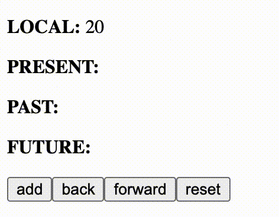

# history-reducer
Dead simple react hook to create state history based on react useReducer. 


## install
```
yarn add history-reducer
```
(TS declarations are shipped within this package)

## Usage

### Actions
| Action   | Description   |
|----------|-------------|
|`push`    |push new current state|
|`back`    |make the prev state the current, and push the current to the future stack|
|`forward` |if available, push the last future state to the current, and make the current the last past state|
|`reset`   |reset past and future state, and optional set a new current state|

### Hook

```js
const [{present, past, future}, dispatch] = useHistoryReducer(0, 5);
```
The hook `useHistoryReducer` returns the current state including `present`, `past` and `future` as the first argument, and a `dispatch` function as second. It accepts a default value as a first argument, and the max length for `past` and `future` as a optionao second argument. 


## Example
#### Basic
```js
import {useHistoryReducer} from "history-reducer";

const Example = () => {
    const [{present, past}, dispatch] = useHistoryReducer(0);
    return (
        <div>
            <p>Current value is {present}, but has been {past} before</p>
            <button onClick={() => dispatch({type:'push', state: present + 1})}>add</button>
            <button onClick={() => dispatch({type: Action.BACK})}>back</button>
        </div>
    )
}
```

Also check out the example [here](example).
